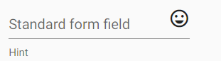

# Design System
---
# C'est quoi un design system ?
> Un Design System s’apparente à une bibliothèque de composants, visuels et principes au code réutilisable. [Usabilis](https://www.usabilis.com/design-system/)
---
# C'est quoi un design system ?
- Pour un UX designer:
    - Ensemble de regles qui vont décrire le comportement de l'application dans son ensemble
- Pour un dev : 
    - C'est une librairie/module à utiliser pour faire de trucs jolie
    - C'est aussi des bonnes pratiques à suivre 
---
# C'est pas juste des class CSS*
- Le css permet de decrire le style uniquement 
    - Il ne permet pas de decrire des interactions 
    - De stocker un  état
    - D'avoir des regles de validation 
    - ....
- Utiliser **que** du css c'est peu evolutif et ça ammene beaucoup de duplication
---
# Comment est decouper un Design System (Cas Atomic Design)
- atome > molecule > molecule >...> Organisme > template > pages 
---
# Atome 
Les composant les plus petits : 
- Bouton
- Label
- ...
Exemple Material : 
    - 
---
# Molecule 
- Composant composé d'atome : 
  - Groupe de boutton
  - form-field
  - ...
- Exemple Material : 
    - 
    - 
---
# Molecule 
Les composants composé de molecule : 
- Paginator
- DatePicker
- ...
Exemple Material : 
    - 
---
# Organismes 
Décrit un composant plus compliqué qui contient plusieurs molecules/Atomes : 
- Le header de l'application
- ...
- ...
---

# Les Templates 
Décrit le comportement generique d'une page
Exemple : Page de recherche

---

# Les Pages 
Application d'un template dans un contexte particulier  : 
Exemple sur un ecran de recherche d'utilisateur :

--- 
# Material
- C'est le Design System de google
- Il est implementé dans plusieurs langages
    - Java - Android
    - Flutter
    - Ios 
    - Web
---

# Le CDK de material*
- Bibliotheque de composant technique pour implementer vos propres composants
- à ne pas confondre avec material
---

# Ajouter material 
[Documentation](https://material.angular.io/)
```shell
ng add @angular/material
```
---
## Qu'est ce que ca fait 
>Add project dependencies to package.json
Add the Roboto font to your index.html
Add the Material Design icon font to your index.html
Add a few global CSS styles to:
Remove margins from body
Set height: 100% on html and body
Set Roboto as the default application font


---
# Structure d'angular
- Tout les composants commence par **mat**
