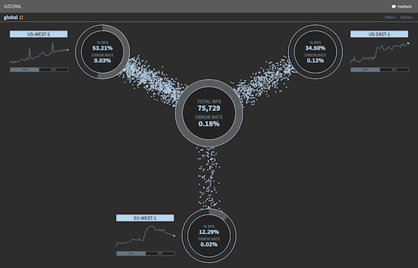
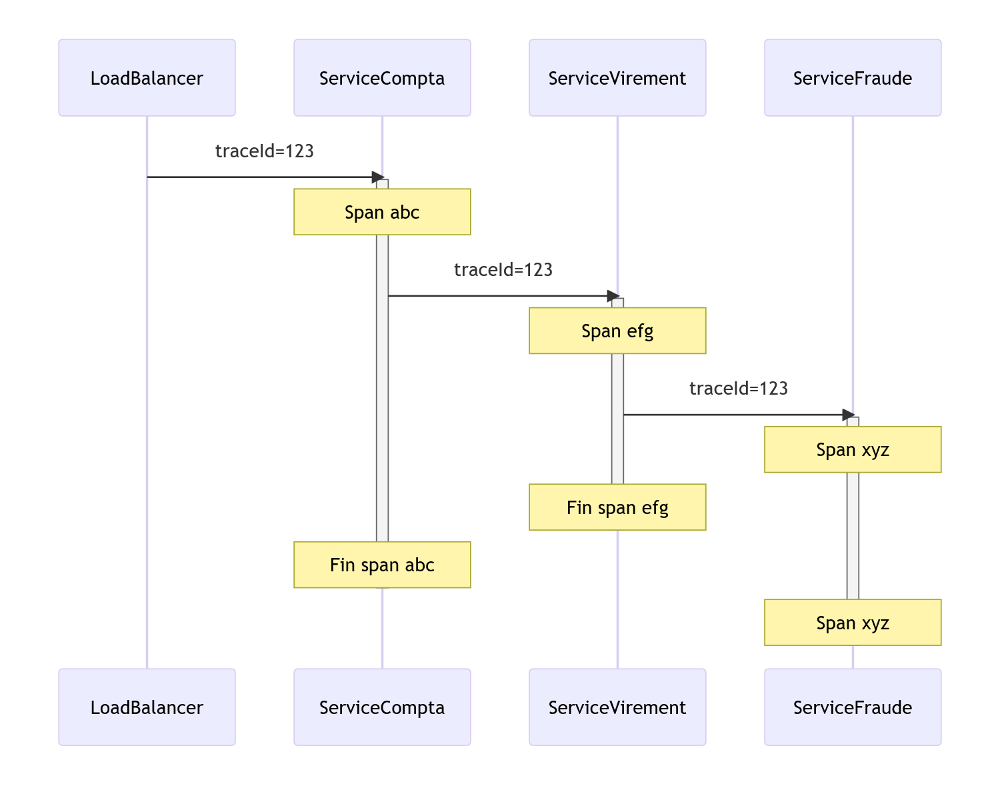

## Monitoring
- Verifier à un intervalle regulier une assertion
- (Un test unitaire en prod)
- Permet de detecter des pannes que l'on peut prevoir
    - Serveur down
    - Disque plein
    - Reseau down (Plus tricky!)
- Ne permet pas 
    - Detecter des pannes inconnu
    - Aider à la resolution des bug
---
## Alerting 
- Prevenir XXX quand une panne est detecté 
- Permet :
    - De reagir à la detection d'une panne
---
## Les logs
- Permet : 
   - Suivre une action en particulier 
- Ne permet pas : 
   - D'avoir une vision global
---
## Observabilite*
- Permet :
    - De comprendre une panne
    - Faciliter la resolution d'une panne
    - (Et être sûre qu'on est sorti de la panne)
- Ne remplace pas le monitoring, les logs et l'alerting
---
## Pourquoi l'observabilite*
- Des systeme de plus en plus complexe
- Des Disponibilités de plus en plus haute 
---
## Exemple d'outil pour l'observabilite*

- Permet de voir les requetes en temps reels
- Cas d'usage : Un des Datacenters qui n'est pas rallumer
---
# Open telemetry (Otel)
4 Signaux  : 
 - Logs 
 - Metrics
 - Traces
 - Baggage*

---
# Comment bien logguer ?
- Utiliser le bon niveau
   - Error, Warning, Info, Debug, Trace 
- Logguer les ecritures
- Aggreger les logs

---
# C'est quoi une metrique ? 
- Une mesure de quelque chose dans l'application
    - Un nombre d'actions
    - Un temps de XXXX
    - Un nombre de ressource reservée
    - ....
---
# Type de recuperation des metriques*
- Scrapping : Le systeme va interroger votre appli pour récuperer les métriques
    - Prometheus 
- Push : Votre appli va pousser les information vers le systeme
    - InfluxDb
    -...
---
# Comment ajouter des metriques dans votre app * 
- A la main :
    - En appelant ou ajoutant un endpoint a votre application
    - Ce n'est pas une bonne idée
- Utiliser une lib 
    - MicroMeter : 
        - C'est une facade qui va permettre d'ajouter des métriques sans connaitre le systeme
        - Compatible avec beaucoup de systeme
        - Api simple a utiliser
---
# Ajouter Micrometer : influx *
build.gradle
```groovy
  implementation "io.micrometer:micrometer-registry-influx:1.9.3"
  implementation "org.springframework.boot:spring-boot-starter-actuator"
```
---
# Ajouter Micrometer : influx *
application.yaml
```yaml
  metrics:
    export:
      influx:
        uri: http://localhost:19086
        bucket: bitcoin
        enabled: true
        api-version: v2
        org: ruokki
        step: 5s
        token: zsOhTZbBAq4K7t5OjagVrJgvNe4rSRe4NXiHE0A__HUDTYmrdjYF0PP2cGSqGNeSUJf8Dmj3z4Jo89wyWyPgfg==

```

---

---
# Ajouter Micrometer : Prometheus **A utiliser pour le projet**
build.gradle
```groovy
  implementation "io.micrometer:micrometer-registry-prometheus:1.9.3"
  implementation "org.springframework.boot:spring-boot-starter-actuator"
```
---
# Ajouter Micrometer : Prometheus **A utiliser pour le projet**
application.yaml
```yaml
management:
  endpoints:
    web:
      exposure:
        include: health,info,metrics
```
---


# Les differents type de mesure
- Les Compteurs (Counter)
- Les Durée (Timer)
- Les Jauges (Gauge)
- Les Resumé de distribution (Distribution Summaries)
---
# Ajouter une metrique (Bad way)
```java
public class MyClass{
    ...
    public void myMethod(){
            counterCall.increment()
            timer.record(()=>{
                try {
                    firstStep()
                    secondStep()
                    finish()
                } catch (Exception e) {
                    counterFail.increment();
                    throw e;
                }
            });
    }
    ...
}      
``` 
---
# Ajouter une metrique (Better way - interface)
- Objectif séparer le code fonctionnel et le code des metriques
- Resuire la complexitée des methodes
```java
public interface MyClass{
    public void myMethod()
}
```
---
# Ajouter une metrique (Better way - Implementation)
```java
public class MyClassImpl implements MyClass{
    public void myMethod(){
        firstStep()
        secondStep()
        finish()
    }
}
```
---
# Ajouter une metrique (Better way - Delegation)
```java
public class MyClassMetrics implements MyClass{
    private final MyClass delegate;
    ...
    public void myMethod(){
            counterCall.increment()
            timer.record(()=>{
                try {
                    this.delegate.myMethod()
                } catch (Exception e) {
                    counterFail.increment();
                    throw e;
                }
            });

    }
}
```
---
# Ajouter une metrique (Better way - Aspect)
Definir des [aspects](https://docs.spring.io/spring-framework/docs/4.3.12.RELEASE/spring-framework-reference/html/aop.html) 

```java
    @Before("execution(public * fully.qualified.name.MyClass.myMethod())")
    public Object duration(ProceedingJoinPoint joinPoint)
            throws Throwable {
        counterCall.increment();        
    }
    @AfterThrow("execution(public * fully.qualified.name.MyClass.myMethod())")
    public Object duration(ProceedingJoinPoint joinPoint)
            throws Throwable {
        counterFail.increment();        
    }

```
---
# Ajouter une metrique (Better way - Aspect)
Definir des [aspects](https://docs.spring.io/spring-framework/docs/4.3.12.RELEASE/spring-framework-reference/html/aop.html) 

```java
    @Around("execution(public * fully.qualified.name.MyClass.myMethod())")
    public Object duration(ProceedingJoinPoint joinPoint)
            throws Throwable {
        Instant startTime = Instant.now();
        try {
            return joinPoint.proceed(joinPoint.getArgs());
        } finally {
            timer.record(Duration.between(startTime, Instant.now()));
            
        }
        
    }

```
---
# Tagguer les metriques
- Ajouter du contexte sur la metrique
- Exemple :  Pour une metrique qui compte des appels sur les endpoints
```java 
registry.counter("nbCall", "path", path).increment()
```
- Permet d'explorer les données de facon plus precise
    - Le nombre d'appel c'est bien 
    - Le nombre d'appel par endpoint c'est mieux
---
# Tagguer les metriques globalement
- Donner des informations sur toutes les metriques
- Exemple :  
```java 
registry.config("serverName", InetAddress.getLocalHost().getHostName());
```
--- 
# Les traces
1. Quand une requete arrivent dans le systeme on lui donne un traceId
2. On fait suivre le traceId durant toute la durée de la requete
3. Et on decoupe l'appel en span
---
# Les traces - schema
 


# Les traces à quoi ca sert ? 
 - Lié les lignes de log 
 - Visualiser les communications entre service
 - Correler les logs et les metriques
 - Visualiser les points de lenteurs de vos requetes