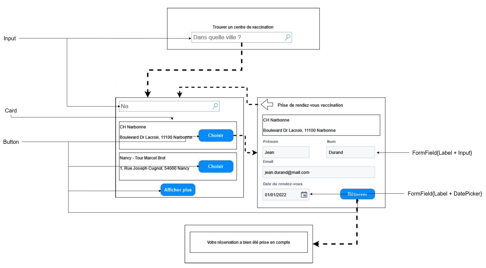
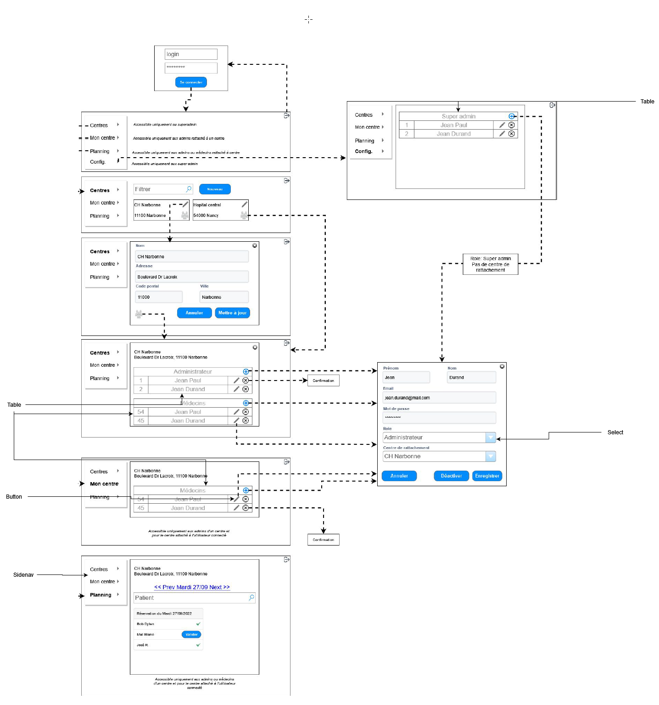

# Partie 1 
- Votre client se demande ce qu'il se passe si un utilisateur frontOffice tombe pas hasard sur le backOffice. Il pense (à juste titre) qu'ajouter un ecran de login au back serait plus sûre)
- Sur votre backOffice mettre en place une basic auth
    - Si l'utilisateur n'est pas connecté, il est redirigé vers l'ecran de login
    - Votre api doit lancer une erreur si l'utilisateur n'est pas connecté
    - Tout vos endpoints pour le backend doivent etre authentifié

---
# Partie 2 
- Pour avoir un suivi de l'activité de votre application, et pouvoir scaller le nombre d'instance de votre application à travers le monde  
  - Ajouter une metrique qui expose le nombre de rendez-vous enregistré
  - Ajouter une metrique qui capture le temps pour enregistrer un rendez-vous

---
# Partie 3
- Votre client a vus les premiers prototype de l'application
- Il ne le trouve pas tres beau...
- Ajouter le design system de google à votre application pour rendre votre application plus user friendly.
  - Composant à remplacer au frontOffice: 
    - 
  - Composant à remplacer au backOffice:
    - 
--- 
# Partie 4
- Votre client à pris connaissance du projet FranceConnect et vous demande de l'integrer au frontOffice
- Ajouter au frontOffice la possibilité de s'authentifier via france connect 
  - Le formulaire à remplir par l'utilisateur sera pres rempli avec les infos recuperer via FranceConnect
  - Il faut utiliser OpenIdConnect
  - Une fois connecté sur FranceConnect on est redirigé vers l'accueil (... c'est pas user friendly mais c'est plus simple)
  